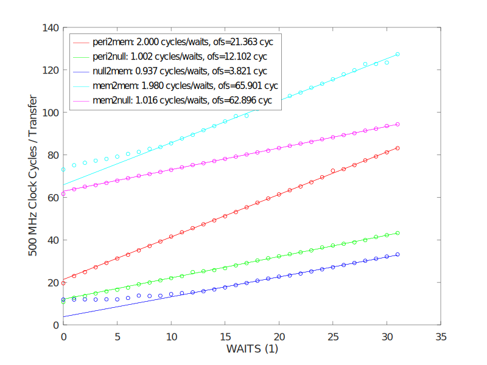
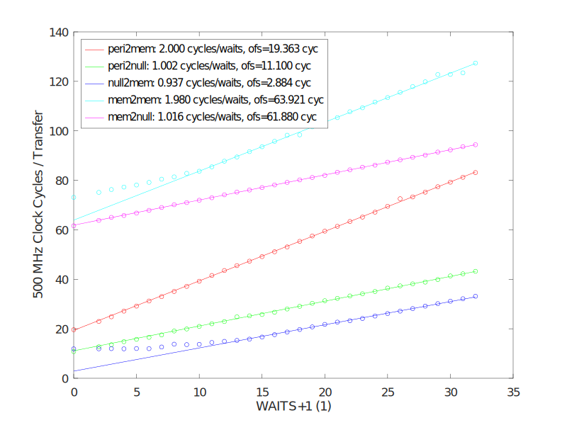
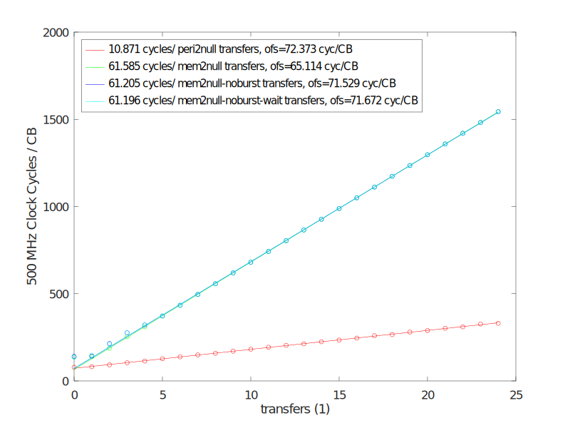

# Introduction

This document is a collection of information missing in the official datasheet of the [Raspberry PI 4 peripherals](https://datasheets.raspberrypi.com/bcm2711/bcm2711-peripherals.pdf). All tests were carried out with a Raspberry PI 4.

This is based on extensive experimentation. While the experimental raw data is provided in the subdirectory [data](data/) the conclusions could be wrong or mistakes could be contained in this writing.

For the experiments the basic idea is to operate the peripherals at very low clock rate and observe their output pins by polling the GPLEV register in a high priority thread. This works provided the GPIO FSEL alt pin assignment is properly set-up. Regardless whether the pin is an input or output, we can always read the current pin level from the GPLEV register. 
This is evident from the Figure 4 on p. 65 in the  [Datasheet](https://datasheets.raspberrypi.com/bcm2711/bcm2711-peripherals.pdf).

So we can make a "software only logic analyzer".

## SPI Controller (RP4)

### CPOL

The clock polarity is defined according to standard SPI terminology. The clock can be active or inactive and depending on the setting of CPOL. This means SCLK HIGH or LOW.

- CPOL == 0: ACTIVE == HIGH, INACTIVE == LOW 
- CPOL == 1: ACTIVE == LOW, INACTIVE == HIGH

Setting of this bit will immediately affect the SCLK pin. So when CPOL == 0, the SCLK pin will be pulled to LOW, and with CPOL == 1 the SCLK pin will be pulled to HIGH.
When TA gets set at a later point in time (and a transmission is about to start), SCLK already has the right logic level. 

### CPHA

This defines when data is clocked out and when is data read in. This is the same for both master and slave.

- CPHA == 0: Write data at falling edge, i.e. at clock transitioning from ACTIVE to INACTIVE and read data at rising edge (INACTIVE -> ACTIVE). Clearly, whether this means a transition from LOW to HIGH or vice versa depends on the CPOL setting.
The SPI controller will write the first data bit before the clock changes for the first time. It also assumes that the slave outputs the first bit upon CS made active. So even thougth the data is written on falling edge, the very start of the clock generation is also considered a "falling edge" despite no actual falling edge being there.
- CPHA == 1: Write data at rising edge, i.e. at clock transitioning from INACTIVE to ACTIVE and read data at falling edge (ACTIVE -> INACTIVE). Clearly, whether this means a transition from LOW to HIGH or vice versa depends on the CPOL setting. The write always happens before the read. Clock starts with INACTIVE and after half a clock cycle data is written and after a complete clock cycle data is sampled.

## DMAEN == 0
### TA

This enables transmission mode of the SPI controller. It has a number of effects. 

- Whenever TA == 1, the CE pin will immediately get set. This is independent whether a clock is generated or not. As long as TA is set, the CS pin(s)will be set.
- In case the FIFO is empty (but TA == 1), no clock will be generated (the SCLK pin is at its INACTIVE setting, which means HIGH or LOW according to CPOL). This will immediately set DONE==1. However TA will remain set.  

- When data is written to the transmit fifo, clock generation will start and a read-write operation is carried out. How long this takes depends on the amount of bytes written to the transmit fifo.

- This means that if the transmit fifo runs empty the clock generation is stopped and no data being transmitted anymore (SCLK being INACTIVE). Even though this will set DONE==1, it does not mean that no data can be transmitted anymore. Th DONE flag will be re-set to 0 whenever new data is fed into the transmit fifo and data transmission is resumed.

- When TA == 0 a write to the FIFO register will NOT write to the internal fifo, but to DLEN and the lowest CS bits. Note that FIFO writes are always 32 bit. The high 16 bits go to DLEN and the low byte to the bits 0:7 to CS. This is as described in the datasheet. However it always works, not just with DMA controller enabled. The typical use case is that this write to the FIFO register sets TA=1, so that subsequent writes to the FIFO register indeed to to the internal transmit fifo. However this is by no means necessary. When TA==0 a write to FIFO register is just a different way to set DLEN and CS[0:7].

- Unlike for DMAEN == 1, the ADCS setting has no effect.

Essentally TA has a 1:1 correspondence with the CS pin. When TA is set, one chip select is active.

### DONE & clock generation

- DONE will be set when the fifo is empty at the time of TA=1.
- DONE will be set half a clock cycle after the last clock cycle of the last transmission has finished and the fifo is empty (CHPA == 1).
- DONE will be set after the last clock cycle of the last transmission has finished and the fifo is empty (CHPA == 0). 

One clock cycle is always INACTIVE for half a cycle and then ACTIVE for half a cycle. After that transition to INACTIVE happens which initiates the next clock cycle.

Note that the byte will be received half a clock cycle earlier than DONE is set. So it may be the case that RXD is set half a clock cycle before DONE is set.
The time when DONE is set, is also the time when the MOSI pin is re-set to 0. It seems that DONE == 1 and MOSI re-set to 0 always happens at the next time of write event after the last regular bit, which is different depending on the CPHA setting. This explains the gap of half a cycle after the transmisson end for CPHA == 1. CLK will stay INACTIVE.


- With CPHA = 1: The writes occur first and the reads at the end of the clock cycle.
  At TA == 1 clock starts INACTIVE (as always). After half a clock cycle the MOSI pin is set with the first bit (MSB) and the clock transitions to ACTIVE. After half a cycle again, clock transitions to INACTIVE and the data is sampled from MISO (also the slave will sample data). After 8 such cycles, a byte is completely received and put into the fifo (this will immediately set RXD). All is MSB first.
  Note that if the tx-fifo is empty the DONE == 1 will be set half a clock cycle **after** this.

- With CPHA = 0: When starting the transfer (TA == 1), the clock remains inactive for half a clock cycle. Then the first bit is written to MOSI and the clock remains another half a cycle being INACTIVE. After one clock cycle after TA == 1, clock transitions from INACTIVE to ACTIVE, which samples the first bit from MISO. Also the slave will sample in the first bit. Note that the slave must also have written its first bit before clock generation started. Since there is no clock transition so far, the first bit must be present as soon as CS is selected. 

Concluding, a N-bit transfer always takes N+0.5 clock cycles between TA == 1 and DONE == 1. Depending on CPHA half a clock cycle is inserted at the begin or at the end of the transmission.

The additional 0.5 cycles seem unnecessary, but are likely due to easier implementation. It seems that the first or last edge of the clock is suppressed, but which is the reason why there is one additional half cycle.

Clearing TA will also clear DONE.

#### Diagram for CPHA == 1:
``` 
          ____________                                                                                       ___________
DONE                  |_____________________________________________________________________________________|           |_____
             ___________________________________________________________________________________________________________
TA        __|                                                                                                           |_____

Tx-FIFO         0     |1|                                      0                                                  
                             ____      ____      ____      ____      ____      ____      ____      ____
SCLK*     __________________|    |____|    |____|    |____|    |____|    |____|    |____|    |____|    |______________________
MOSI                     0  |    D7   |    D6   |    D5   |    D4   |    D3   |    D2   |    D1   |    D0   |  0    
MISO                     0  |    D'7  |    D'6  |    D'5  |    D'4  |    D'3  |    D'2  |    D'1  |          D'0        |    
Rx-FIFO                                                        0                                       | 1         
``` 
There is a brief write to the tx-fifo, which sets DONE=0 and starts the transmission. The Rx-FIFO is filled one half cycle before DONE
is asserted and MOSI being re-set.

* Note SCLK is shown for CPOL == 0. For CPOL == 1 it is same but inverted.

#### Diagram for CPHA == 0:
``` 
          _____________                                                                                      ___________
DONE                   |____________________________________________________________________________________|           |_____
             ___________________________________________________________________________________________________________
TA        __|                                                                                                           |_____

Tx-FIFO         0     |1|                                      0                                                  
                                  ____      ____      ____      ____      ____      ____      ____      ____
SCLK*     _______________________|    |____|    |____|    |____|    |____|    |____|    |____|    |____|    |_________________
MOSI                     0  |    D7   |    D6   |    D5   |    D4   |    D3   |    D2   |    D1   |    D0   |  0    
MISO      0 |           D'7           |    D'6  |    D'5  |    D'4  |    D'3  |    D'2  |    D'1  |    D'0  |  D2'7 (*)| 0   
Rx-FIFO                                                        0                                       | 1         
``` 
There is a brief write to the tx-fifo, which sets DONE=0 and starts the transmission. The Rx-FIFO is filled one half cycle before DONE
is asserted and MOSI being re-set.

As usual for SPI with CPHA=0, the slave needs to have its first bit ready right after CS is asserted. This is because the first data sampling
happends at the first rising edge of the clock. While the master outputs the first bit when data becomes available (half a clock cycle after the fifo is filled) and not already when the CS being pulled low (TA = 1), the slave cannot do this as it passive and has to react on SCLK and CS. Since CS going low is the only event before the first clock edge, this is the only thing it can do. This is nothing special about the Raspberry PI SPI controller, it is normal SPI behavior.

## DMAEN == 1

- This enables 4 byte writes and reads to the tx-fifo via FIFO. Writing 0x115577ff to the FIFO results in 
0xff, 0x77, 0x55, 0x11 being written to the tx-fifo in that order. So 0xff will be transmitted first.
- This has the implication that always 4 bytes are written to the fifo, even if only 3 bytes are to be transmitted. Then one byte remains in the tx-fifo after the transfer.

- DLEN will control the number of bytes to write. It will set DONE after the amount of bytes have been written. The TA bit is not cleared by that mechanism (ADCS == 0). With ADCS == 1, the TA bit is cleared at the same time when DONE == 1. This will also de-assert CS. ADCS has only an effect when DMAEN == 1. 

- DONE is now controlled by DLEN. After DLEN bytes have been transmitted, DONE will be set to 1. DONE will be reset by clearing TA. Unlike for DMAEN == 0, the fifo being empty has no effect on DONE.
DONE is a sticky bit. Even if the DLEN register is changed during an active transfer TA == 1 and new data is written to the fifo, the DONE bit is not cleared. The new data is transmitted though.

- ADCS will clear TA after DLEN bytes have been transmitted. TA is cleared at the same time DONE is being set. (See also DONE behavior).
  Note: if DLEN == 0 at the time TA is being written to 1 and ADCS == 1, then this will not set TA at all (it will stay == 0) instead DONE == 1. 

- Writing to DLEN resets the internal state machine, in the sense that new bytes can be transmitted. This however does not reset DONE.

### DLEN register

After each byte has been transmitted, the DLEN register is decremented by one. When DLEN reaches 0, the transfer is considered finished and DONE is set to 1.

### RXD

This bit means that the rx-fifo is non-empty, i.e. contains at least one byte.

### DC.RDREQ
The fifo level at which a read DREQ signal is generated. The datasheet is accurate that

    RX-DREQ = ( number-of-bytes-in-rx-fifo > RDREQ ) || (DMAEN == 1 && DLEN == 0 && number-of-bytes-in-rx-fifo > 0)

Note that the fifos are bytewise fifos. They are written byte by byte from the spi engine. 
When a 8 bit transfer is complete the byte will be pushed to the fifo. This is irrespective on how long the whole transfer is.
Whenever 8 bits are received a byte will be added to the fifo. This happens right after the clock transition at which the 
8-th bit is received. It does not wait for the clock cycle to complete (which is half a clock cycle later).

When the rx-fifo is non-empty the RXD bit is set.
So for a 16 bit transfer, the RXD bit will become set after 8 bits have been received. 

With DMAEN == 1 the RX-DREQ will also be set when DLEN reaches 0. This happens as soon as the last byte is received. So it also happens half a clock cycle before the DONE bit is set (and in case of ADCS also TA is cleared).

### DC.TDREQ
The fifo level at which a write DREQ signal is generated. The datasheet is accurate that

    TX-DREQ = ( number-of-bytes-in-tx-fifo <= TDREQ )


#### Diagram for CPHA == 1:
Here we set DLEN == 2.

``` 
          ____________                                                 ___________
DONE                  |_______________________________________________|           |_____
             _____________________________________________________________________
TA        __|                                                                     |_____

Tx-FIFO         0     |4|        3          |      2                                                             
DLEN      2                                 |      1        |      0                                                  
                             ____       ____      ____       ____      
SCLK*     __________________|    | ... |    |____|    | ... |    |_______________________
MOSI                     0  |     D7 ... D0      |   D2 7 ... D2 0    |  0    
MISO                     0  |    D'7 ... D'0     |   D2'7 ... D2'0                |  0     
Rx-FIFO           0                         | 1             |    2
``` 
There is a brief write to the tx-fifo, which adds 4 bytes, sets DONE=0 and starts the transmission. 
With every complete byte received DLEN is decremented and one byte written to the fifo. Note that there is still two bytes in the tx-fifo after the transmission ended!

If ADCS were set, the TA would automatically be set to zero when DONE == 1.

* Note SCLK is shown for CPOL == 0. For CPOL == 1 it is same but inverted.

#### Diagram for CPHA == 0:
``` 
          ____________                                                 ___________
DONE                  |_______________________________________________|           |_____
             _____________________________________________________________________
TA        __|                                                                     |_____

Tx-FIFO         0     |4|        3          |      2                                                             
DLEN      2                                 |      1        |      0                                                  
                                  ____       ____      ____       ____      
SCLK*     _______________________|    | ... |    |____|    | ... |    |_______________________
MOSI                 0      |     D7 ... D0      |   D2 7 ... D2 0    |  0    
MISO                  |          D'7 ... D'0     |   D2'7 ... D2'0    |  D3'7     | 0       
Rx-FIFO           0                         | 1             |    2
``` 

There is a brief write to the tx-fifo, which adds 4 bytes, sets DONE=0 and starts the transmission. 
With every complete byte received DLEN is decremented and one byte written to the fifo. Note that there is still two bytes in the tx-fifo after the transmission ended. 

If ADCS were set, the TA would automatically be set to zero when DONE == 1.

* Note SCLK is shown for CPOL == 0. For CPOL == 1 it is same but inverted.


## PWM Controller (RP4)

### DMAC.DREQ definition

The definition of the DMAC.DREQ field is missing from the datasheet.
By experimentation it was found that 

``` 
DREQ-signal = number-of-words-in-fifo < DMAC.DREQ
``` 
The DMAC signal is not a trigger, but a signal that is set as long as the condition prevails.

Setting DMAC.DREQ=0 will not activate the DMA at all and no data is transmitted at any time.

This can be verified by observing the number of 32bit DMA transfers to the FIF register with a certain DMAC.DREQ setting and PWM engine being off (PWEN == 0, but DMA and USEF being configured). With DMAC.DREQ == N we observe exactly immediate N DMA transfers (which does put N words in the FIFO and then the process stops). When the PWM is enabled (PWEN =1) this triggers additional FIFO loads.

Note that this definition is different from the fifo threshold definition in other peripherals. The SPI controller has '<=' instead of '<', so there is inconsistency. Also for PWM the threshold is number of 32 bit words and for SPI it is number of bytes. (This is apparently because the SPI fifo is a byte fifo and for PWM it is 32 bit fifo, but the datasheet does not spell this out very clearly). 

## FIF register

The fifo is written to by writing a 32 bit word to the FIF register.


## FIFO

### Writing to the fifo
- By writing to the FIF register.
- Whenever the fifo is empty the EMPT1 bit is set and it is cleared when the fifo is non-empty.
- If DMAC is enabled, the DREQ signal gets set, when the number of words in the fifo falls below the threshold (see above). The DMAC signal is not a trigger, but a signal that is set as long as the condition prevails. 
- DMAC get set even if the pwm generation is not enabled (PWEN), so when the DMA is properly configured, the fifo is filled up to the DMAC threshold before at the time when PWEN will get set.

### Reading from the FIFO

The PWM engine starts reading from the fifo when the PWEN bit gets set. The amount of words depends on the opeation mode.

Upon enablement of the PWM the PWM engine will read the following amount of words from the FIFO

| Mode  | FIFO reads upon PWM start | Duplicate anomaly |  Last word repeated indefinitely |
|----|---|----|----|
| Single Channel, RPT=0, fifo level=1  |  1 (4 bytes) | No | **Yes** | 
| Single Channel, RPT=0, fifo level>1  |  2 (8 bytes) | No | **Yes** | 
| Single Channel RPT=1 | 1 (4 bytes) | **Yes, first word** | Yes |
| Dual Channel, RPT=0, fifo level=2 | 2 (8 bytes), one sample for each channel | No | No (Stops after one PWM sample) |
| Dual Channel, RPT=0, fifo level>3 | 4 (16 bytes), two samples for each channel | No | No |
| Dual Channel, RPT=1  | 2 (8 bytes), two for each channel | **Yes, every word is duplicated** | Yes  |

Bold marks incorrect or buggy behavior.

It seems that the PWM engine has one additional word buffer besides the fifo. This explains why two words are loaded from the fifo upon PWM start (if there are at least two words in the fifo, or only one if there is only one). One word becomes the currently generated sample and the additional buffer receives the second word. So there is kind of a 1 word internal fifo in the pwm engine. However, the behavior seems to be odd with the RPT functionality. Sometimes, pwm samples are duplicated, i.e. generated twice even though it should not happen. 

### Note regarding the RPT1 and RPT2 bits 

The repeat last word functionality seems broken, as it apparently does not work as intended.

- If only a single channel is enabled (so we only have CTL.PWEN1 set, but not CTL.PWEN2 set for instance) the CTL.RPTL1/2 bits are ignored. The last word is ALWAYS repeated. STA.STA1 will remain high (as the PWM never stops)

- Contrary to one channel operation the RPTL=0 is working for two channel case: the PWM stops after N'th sample and sets STA.STA2=STA.STA1=0 (as well as sets STA.GAPO2=STA:GAPO1=1 to indicate gaps during transfer.
The CTL.RPTL1=CTL.RPTL2=1 are not supported in two channel mode.

## DMA Controller (RP4)

### DMA transfer speed and influence of wait cycles setting



Result is average of 100 runs with 10240, 32 bit words transferred. Time is shown for a single 32 bit transfer.

`mem` means reading / writing to memory. ` periph` is reading from the System Timer CLO register, `null` means with SRC_IGNORE or DEST_IGNORE flag set in the DMA CB.

The point at WAITS = 0 is given by
| trace | value at WAITS=0 | explanation | flags |
| ------ | ------- | ------ | ----- |
| peri2mem |  19.6 cycles | read from peripheral (System timer) and write to memory | NO_WIDE_BURST+ WAIT_RESP+DEST_INC |
| peri2null |  10.8 cycles | read from peripheral (System timer)| NO_WIDE_BURST+ WAIT_RESP+DEST_INC+DEST_IGNORE |
| null2mem |  11.9 cycles |  write to memory | DEST_INC+SRC_IGNORE |
| mem2mem | 73.1 cycles | read from memory and write to other memory location | SRC_INC+DEST_INC |
| mem2null |  61.6 cycles | read from memory | SRC_INC+DEST_IGNORE|


Unit is in clock cycles of the 500 MHz system cloc (so one cycle equals 2 ns). System was set to performance mode so that system clock is not adjusted during runs.

Observations:
 - wait cycles are in units of system clock of 500 MHz (2 ns). So WAITS==31 adds 124 ns additional delay unless SRC_IGNORE or DEST_IGNORE is set, in which case only 62 ns additional delay is added. Likely there is an additional (undocumented) cycle so that it is really 128 ns and 64 ns additional wait time for for WAITS==31.
 - the datasheet is correct that a wait cycle happens at *both* reads *and* writes. This is evident from the slope of 1 or 2 in the graph wth DEST_IGNORE or SRC_IGNORE being set.
 - depending on the nature of the operation (read/write from memory or peripherial) the time for the transfer may be much higher than the waiting. This is especially the case if a read from memory happens.
 - the DMA controller seems to execute read and writes in parallel when SRC_INC and DEST_INC is set. This is evident from the mem2mem and null2mem traces. Consecutive reads and writes apparently are executed in parallel. That is why mem2mem has a slope of 1 before it transitions to a slope of 2 in the graph. For null2mem this is obvious from the constant offset.
  - the dma controller seems to wait for one additional cycle if WAITS > 0. The curves are much more linear when we assume the additional wait cycles to be one more (see below). So if WAITS is nonzero, the number of actual additonal wait cycles per read and write is really WAITS+1.

We can see from the figure that the linear fit is much better for the first point.

The fit for the point is much better at WAITS==0 when assuming one additional wait cycle:



### Time for loading a DMA CB

Test case: have a chain of 10240 DMA CBs where each CB does a certain number of 32bi transfers. 

Time per CB versus the number of 32bit transfers in each CB:


First two data points are
| type | time @ TXLEN==0 | time @ TXLEN==4 |
| ---- | ---- | ---- | 
| peri2null | 78.3 cycles |   81.6 cycles |
| mem2null  | 137.4 cycles |   139.4 cycles |
|mem2null-noburst| 141.0 cycles   | 142.7 cycles|
|mem2null-noburst-wait| 136.6 cycles  |  147.6 cycles|

Observations:
 - Loading a CB takes approximately 72 clock cycles (144 ns). 
 - Even with TXLEN == 0 in the CB the DMA controller performs one transfer. TXLEN == 4 seems minimum. 
 - Loading a full CB (which is 6 x 32 bit words) is only slightly longer than doing a single 32bit memory read via DMA (~ 72 cycles vs. ~62 cycles), but about 6 times longer than doing a single peripheral read (11 cycles).
 